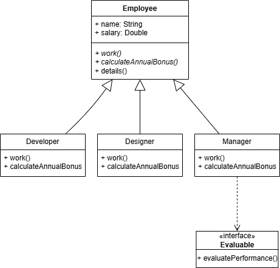

# Sistema de Gestión de Empleados

## Descripción del Proyecto
Este proyecto implementa un sistema básico de gestión de empleados utilizando programación orientada a objetos en Kotlin. 
El sistema permite crear diferentes tipos de empleados, gestionar sus atributos y realizar evaluaciones de desempeño.

## Estructura del Proyecto
* src/: tiene el código fuente en Kotlin.
* docs/: tiene el diagrama de clases UML.

## Tecnologías Utilizadas
* Kotlin: Lenguaje de programación principal
* IntelliJ IDEA: Entorno de desarrollo
* Git: Control de versiones
* Draw.io: Para crear el diagrama

## Diagrama de Clases
El sistema se basa en una clase abstracta Employee de la que heredan:
* Developer
* Manager
* Designer

Además, se utiliza la interfaz Evaluable para definir el método evaluatePerformance() que ciertos empleados especificos (como el Manager, para añadir funcionalidad extra).

Esquema del diagrama de clases: (Tambien esta en la carpeta docs/)

